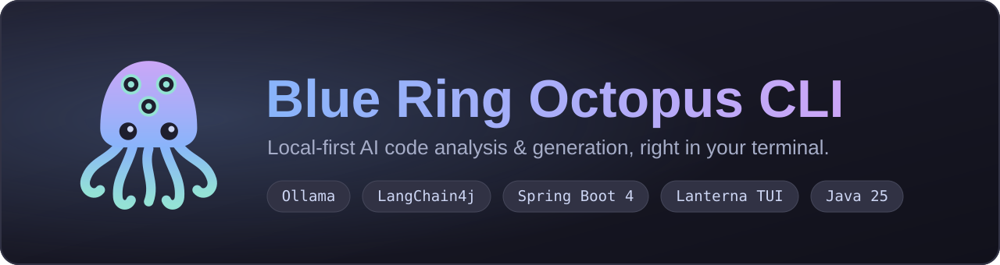
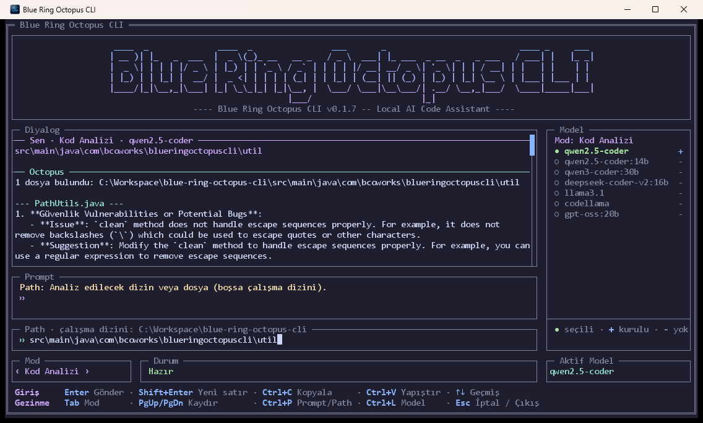
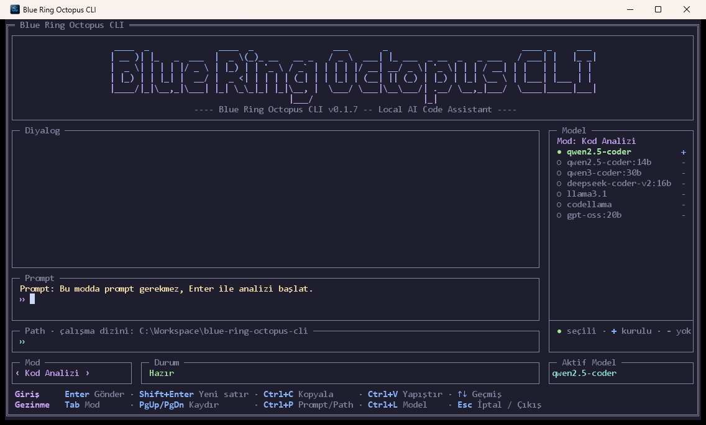
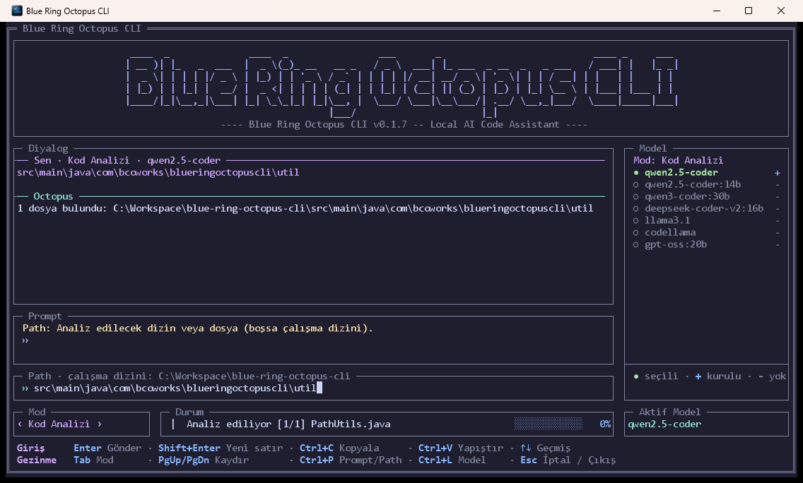
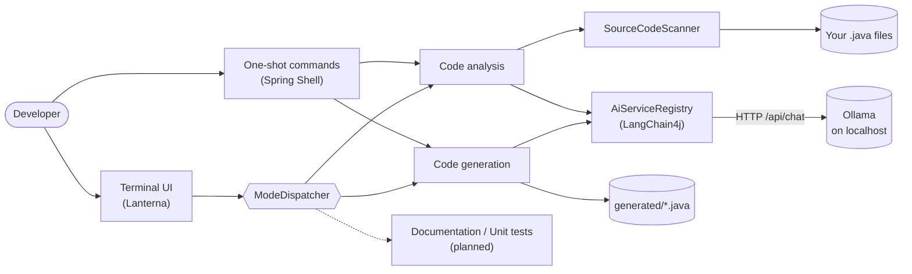

<h1 align="center">
  
</h1>

<p align="center">
  <a href="https://github.com/burak-can-onarim/blue-ring-octopus-cli/actions/workflows/ci.yml"></a>
  <a href="https://github.com/burak-can-onarim/blue-ring-octopus-cli/actions/workflows/codeql.yml"></a>
  <a href="https://github.com/burak-can-onarim/blue-ring-octopus-cli/releases"></a>
  <a href="LICENSE"></a>
  <a href="https://github.com/burak-can-onarim/blue-ring-octopus-cli/pkgs/container/blue-ring-octopus-cli"></a>
  <a href="CONTRIBUTING.md"></a>
</p>

<p align="center">
  
  
  
  
</p>

<p align="center">
  <b>English</b> · <a href="README.tr.md">Türkçe</a>
</p>

**Blue Ring Octopus CLI** is a terminal application that reviews and writes Java code with a large language model
that runs **on your own machine**. It talks to [Ollama](https://ollama.com) through
[LangChain4j](https://docs.langchain4j.dev), so your source code never leaves your computer, there is no API key to
manage and no per-token bill.

<p align="center">
  
</p>

## Contents

- [Why Blue Ring Octopus](#why-blue-ring-octopus)
- [Features](#features)
- [Quick start](#quick-start)
- [Usage](#usage)
- [Configuration](#configuration)
- [Run with Docker](#run-with-docker)
- [How it works](#how-it-works)
- [Roadmap](#roadmap)
- [Development](#development)
- [Contributing, security and license](#contributing-security-and-license)

## Why Blue Ring Octopus

| | |
|---|---|
| **Local-first** | Prompts and source files are sent only to the Ollama instance you configure (`localhost` by default). |
| **No running costs** | No cloud account, no API key, no token metering. Pick any model Ollama can run. |
| **Built for Java** | Reviews cover bugs, security, performance and Clean Code. Generation produces a compilable Java type and saves it to disk. |
| **Safe by default** | Existing files are never overwritten, oversized files are skipped, and every long task can be cancelled. |
| **A real terminal UI** | A full-screen [Lanterna](https://github.com/mabe02/lanterna) interface with history, multi-line prompts, clipboard support and a live model panel. |

## Features

- **Code analysis mode.** Scans a file or a whole directory for `.java` files and reviews each one for security
  problems, bugs, performance risks and Clean Code violations. Build and tooling folders (`.git`, `target`,
  `node_modules`, ...) are skipped, and files larger than 64 KB are never sent to the model.
- **Code generation mode.** Describe a class in plain language; the model returns Java source, Markdown fences are
  stripped, the type name is detected and the file is written to `generated/<ClassName>.java` (or a path you choose).
  An existing file is never overwritten.
- **A model per mode.** Choose a different Ollama model for each mode with <kbd>Ctrl</kbd>+<kbd>L</kbd>. The panel
  colours the models: the selected one green, installed ones blue (`+`) and missing ones grey (`-`). The choice is
  remembered between runs.
- **Comfortable terminal UI.** A conversation view that keeps the requests and answers of the session and follows the
  newest message, multi-line prompt, input history, paste from the clipboard, copy the last output, progress bar,
  mouse wheel scrolling and instant cancellation.
- **Scriptable.** Every mode is also available as a one-shot command (`analyze`, `generate`), so it works in scripts
  and containers.
- **Two more modes are on the way:** documentation writing and unit-test generation (see the [roadmap](#roadmap)).

> [!NOTE]
> The interface text and the language of the analysis report are currently **Turkish**. The model is asked to answer
> in Turkish by design; see the [roadmap](#roadmap) for localisation ideas.

<table>
  <tr>
    <td align="center"><br><sub>Welcome screen and model panel</sub></td>
    <td align="center"><br><sub>Analysis in progress</sub></td>
  </tr>
</table>

## Quick start

### Requirements

| Requirement | Notes |
|---|---|
| **JDK 25** | Needed to run the JAR or to build from source. |
| **[Ollama](https://ollama.com/download)** | Must be running (default `http://localhost:11434`). |
| **A coding model** | For example `ollama pull qwen2.5-coder`. |

> Windows is the primary tested platform. On Windows the application opens its own terminal window; on Linux and
> macOS it renders inside the current terminal.

### Option 1 — Download a release

1. Download `blue-ring-octopus-cli-<version>.jar` from the [Releases page](https://github.com/burak-can-onarim/blue-ring-octopus-cli/releases).
2. Start it:

```bash
java --enable-native-access=ALL-UNNAMED -jar blue-ring-octopus-cli-<version>.jar
```

Every release also publishes a `.sha256` checksum next to the JAR.

### Option 2 — Build from source

```bash
git clone https://github.com/burak-can-onarim/blue-ring-octopus-cli.git
cd blue-ring-octopus-cli
./mvnw -DskipTests package
java --enable-native-access=ALL-UNNAMED -jar target/blue-ring-octopus-cli.jar
```

On Windows you can use `mvnw.cmd` for the build and the bundled `start-agent.bat` launcher, which also lets you pick
the model from a small menu.

Run `scripts\create-shortcut.bat` once to put a **Blue Ring Octopus CLI** shortcut with the application icon on your
Desktop; it starts `start-agent.bat`.

### Option 3 — Docker

See [Run with Docker](#run-with-docker).

## Usage

### Full-screen UI

Run the application **without arguments** to open the UI. <kbd>Tab</kbd> switches the mode, you type a prompt and/or a
path, and <kbd>Enter</kbd> runs it.

| Key | Action |
|---|---|
| <kbd>Enter</kbd> | Run the current mode |
| <kbd>Shift</kbd>+<kbd>Enter</kbd> or a trailing `\` | New line in the prompt |
| <kbd>Tab</kbd> / <kbd>Shift</kbd>+<kbd>Tab</kbd> | Next / previous mode |
| <kbd>↑</kbd> <kbd>↓</kbd> | Move through lines, then through input history |
| <kbd>Ctrl</kbd>+<kbd>P</kbd> | Switch between the Prompt and Path fields |
| <kbd>Ctrl</kbd>+<kbd>L</kbd> | Open the model panel for the current mode |
| <kbd>Ctrl</kbd>+<kbd>V</kbd> / <kbd>Shift</kbd>+<kbd>Insert</kbd> | Paste from the clipboard |
| <kbd>Ctrl</kbd>+<kbd>C</kbd> | Copy the last output to the clipboard |
| <kbd>PgUp</kbd> / <kbd>PgDn</kbd>, mouse wheel | Scroll the conversation (the wheel also scrolls a long prompt) |
| Left click | Focus the Prompt or Path field (and place the caret) |
| <kbd>Esc</kbd> | Cancel the running task, or ask to exit |

### One-shot commands

Pass a command as an argument and the application runs it and exits.

```bash
# Review every .java file under ./src
java --enable-native-access=ALL-UNNAMED -jar blue-ring-octopus-cli.jar analyze --pathInput ./src

# Generate a class and save it to generated/<ClassName>.java
java --enable-native-access=ALL-UNNAMED -jar blue-ring-octopus-cli.jar generate \
  --prompt "A thread-safe LRU cache with a configurable capacity"

# Generate to a specific file
java --enable-native-access=ALL-UNNAMED -jar blue-ring-octopus-cli.jar generate \
  --prompt "A Spring REST controller for products" --out src/main/java/demo/ProductController.java
```

Run `help` for the full command list. More detail, including troubleshooting, is in [docs/USAGE.md](docs/USAGE.md).

## Configuration

| Setting | How to change it | Default |
|---|---|---|
| Default model | `AI_MODEL_NAME` environment variable | `qwen2.5-coder` |
| Model per mode | <kbd>Ctrl</kbd>+<kbd>L</kbd> in the UI (saved to `~/.octopus-cli/models.properties`) | the default model |
| Ollama address | `LANGCHAIN4J_OLLAMA_CHAT_MODEL_BASE_URL` environment variable | `http://localhost:11434` |
| Temperature, timeout | `langchain4j.ollama.chat-model.*` in `application.yaml` | `0.2`, `5m` |
| Log file | `LOGGING_FILE_NAME` environment variable | `logs/octopus.log` |

```bash
# Windows (PowerShell)
$env:AI_MODEL_NAME = "qwen2.5-coder:14b"

# Linux / macOS
export AI_MODEL_NAME="qwen2.5-coder:14b"
```

## Run with Docker

Images are published to the GitHub Container Registry on every release.

```bash
# One-shot review of the current directory (Ollama runs on the Docker host)
docker run --rm -v "$PWD:/workspace" \
  ghcr.io/burak-can-onarim/blue-ring-octopus-cli:latest \
  analyze --pathInput /workspace/src

# Generation writes into the mounted directory, so run as your own user
docker run --rm --user "$(id -u):$(id -g)" -v "$PWD:/workspace" \
  ghcr.io/burak-can-onarim/blue-ring-octopus-cli:latest \
  generate --prompt "A thread-safe LRU cache" --out /workspace/generated/LruCache.java

# Full-screen UI inside the container
docker run -it --rm -v "$PWD:/workspace" ghcr.io/burak-can-onarim/blue-ring-octopus-cli:latest
```

The image points at `http://host.docker.internal:11434` by default. On Linux add
`--add-host=host.docker.internal:host-gateway`, or set `LANGCHAIN4J_OLLAMA_CHAT_MODEL_BASE_URL` to wherever Ollama
listens. To build the image yourself: `docker build -t blue-ring-octopus-cli .`

## How it works



The UI and the one-shot commands share the same mode handlers, so behaviour is identical in both. Handlers talk to
the user only through a small console interface, which keeps them free of UI code and easy to test. The full picture,
with sequence diagrams and the persistence model, is in [docs/ARCHITECTURE.md](docs/ARCHITECTURE.md).

## Roadmap

| Status | Item |
|---|---|
| ✅ Done | Code analysis mode, code generation mode, full-screen UI, per-mode model selection |
| ✅ Done | One-shot commands, Docker image, CI and release automation |
| 🚧 Planned | **Documentation writing** mode (`Döküman Hazırlama`) |
| 🚧 Planned | **Unit-test generation** mode (`Birim Test Yazdırma`) |
| 💡 Idea | English (and other) interface languages and report language |
| 💡 Idea | Analysis and generation for languages other than Java |

Ideas are not commitments. If one matters to you, [open an issue](https://github.com/burak-can-onarim/blue-ring-octopus-cli/issues/new/choose) and say why.

## Development

```bash
./mvnw verify          # compile, run all tests, build target/blue-ring-octopus-cli.jar
./mvnw test            # tests only
```

| Path | Purpose |
|---|---|
| `src/main/java/.../mode` | Mode handlers and the dispatcher |
| `src/main/java/.../model` | Ollama client registry, installed-model discovery, per-mode settings |
| `src/main/java/.../tui` | Lanterna user interface |
| `src/main/java/.../cli` | Spring Shell one-shot commands |
| `src/main/java/.../service` | AI prompts (`ICodeAnalyzerService`) and the source scanner |
| `docs/` | Architecture, usage guide and image assets |

Java 25 is required. CI runs the build and the tests on Linux and Windows for every push and pull request.

## Contributing, security and license

- Contributions are welcome. Please read [CONTRIBUTING.md](CONTRIBUTING.md) and the [Code of Conduct](CODE_OF_CONDUCT.md).
- Found a vulnerability? Please follow [SECURITY.md](SECURITY.md) rather than opening a public issue.
- A list of changes between versions lives in [CHANGELOG.md](CHANGELOG.md).
- Released under the [MIT License](LICENSE).

---

<p align="center">
  Built with <a href="https://ollama.com">Ollama</a>, <a href="https://docs.langchain4j.dev">LangChain4j</a>,
  <a href="https://spring.io/projects/spring-boot">Spring Boot</a>, <a href="https://spring.io/projects/spring-shell">Spring Shell</a>
  and <a href="https://github.com/mabe02/lanterna">Lanterna</a>.
</p>
