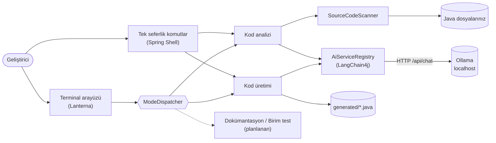

<h1 align="center">
  
</h1>

<p align="center">
  <a href="https://github.com/burak-can-onarim/blue-ring-octopus-cli/actions/workflows/ci.yml"></a>
  <a href="https://github.com/burak-can-onarim/blue-ring-octopus-cli/actions/workflows/codeql.yml"></a>
  <a href="https://github.com/burak-can-onarim/blue-ring-octopus-cli/releases"></a>
  <a href="LICENSE"></a>
  <a href="https://github.com/burak-can-onarim/blue-ring-octopus-cli/pkgs/container/blue-ring-octopus-cli"></a>
  <a href="CONTRIBUTING.md"></a>
</p>

<p align="center">
  
  
  
  
</p>

<p align="center">
  <a href="README.md">English</a> · <b>Türkçe</b>
</p>

**Blue Ring Octopus CLI**, Java kodunu **kendi bilgisayarınızda çalışan** bir büyük dil modeliyle inceleyen ve yazan bir
terminal uygulamasıdır. [LangChain4j](https://docs.langchain4j.dev) üzerinden [Ollama](https://ollama.com) ile
konuşur; kaynak kodunuz bilgisayarınızdan çıkmaz, yönetilecek bir API anahtarı ve token faturası yoktur.

<p align="center">
  
</p>

## İçindekiler

- [Neden Blue Ring Octopus](#neden-blue-ring-octopus)
- [Özellikler](#özellikler)
- [Hızlı başlangıç](#hızlı-başlangıç)
- [Kullanım](#kullanım)
- [Yapılandırma](#yapılandırma)
- [Docker ile çalıştırma](#docker-ile-çalıştırma)
- [Nasıl çalışır](#nasıl-çalışır)
- [Yol haritası](#yol-haritası)
- [Geliştirme](#geliştirme)
- [Katkı, güvenlik ve lisans](#katkı-güvenlik-ve-lisans)

## Neden Blue Ring Octopus

| | |
|---|---|
| **Önce yerel** | İstekler ve kaynak dosyalar yalnızca sizin belirlediğiniz Ollama'ya gider (varsayılan `localhost`). |
| **Çalışma maliyeti yok** | Bulut hesabı, API anahtarı, token sayacı yok. Ollama'nın çalıştırabildiği her modeli seçebilirsiniz. |
| **Java için tasarlandı** | İnceleme hata, güvenlik, performans ve Clean Code başlıklarını kapsar. Üretim, derlenebilir bir Java tipi yazıp diske kaydeder. |
| **Varsayılanı güvenli** | Var olan dosyanın üzerine asla yazılmaz, büyük dosyalar atlanır, uzun işlemler iptal edilebilir. |
| **Gerçek bir terminal arayüzü** | Geçmiş, çok satırlı prompt, pano desteği ve canlı model paneli olan tam ekran [Lanterna](https://github.com/mabe02/lanterna) arayüzü. |

## Özellikler

- **Kod analizi modu.** Bir dosyayı ya da bir dizini `.java` dosyaları için tarar; her birini güvenlik açıkları, hatalar,
  performans riskleri ve Clean Code ihlalleri açısından inceler. Derleme ve araç klasörleri (`.git`, `target`,
  `node_modules`, ...) atlanır; 64 KB'tan büyük dosyalar modele hiç gönderilmez.
- **Kod üretim modu.** Bir sınıfı düz metinle anlatın; model Java kaynağı döndürür, Markdown çitleri temizlenir, tip adı
  bulunur ve dosya `generated/<SınıfAdı>.java` (ya da seçtiğiniz yol) olarak kaydedilir. Var olan dosyanın üzerine yazılmaz.
- **Mod başına model.** Her mod için <kbd>Ctrl</kbd>+<kbd>L</kbd> ile farklı bir Ollama modeli seçin. Panel hangi
  modelleri renklendirir: seçili olan yeşil, kurulu olanlar mavi (`+`), eksik olanlar gri (`-`). Seçiminiz oturumlar
  arasında hatırlanır.
- **Rahat terminal arayüzü.** Oturumdaki istekleri ve yanıtları tutan, en yeni mesajı izleyen bir diyalog görünümü, çok
  satırlı prompt, giriş geçmişi, panodan yapıştırma, son çıktıyı kopyalama, ilerleme çubuğu, fare tekerleği ve anında
  iptal.
- **Betiklenebilir.** Her mod tek seferlik komut olarak da vardır (`analyze`, `generate`); betiklerde ve konteynerlerde
  çalışır.
- **İki mod daha yolda:** dokümantasyon yazma ve birim testi üretme ([yol haritası](#yol-haritası)).

> [!NOTE]
> Arayüz ve modelin yanıtları **English** (varsayılan), **Türkçe**, **Deutsch**, **Français**, **Italiano** ve
> **Español** dillerinde gelir. Değiştirmek için <kbd>Ctrl</kbd>+<kbd>G</kbd>, bkz. [Language](docs/USAGE.md#language).

<table>
  <tr>
    <td align="center"><br><sub>Karşılama ekranı ve model paneli</sub></td>
    <td align="center"><br><sub>Süren analiz</sub></td>
  </tr>
</table>

## Hızlı başlangıç

### Gereksinimler

| Gereksinim | Not |
|---|---|
| **JDK 25** | JAR'ı çalıştırmak ya da kaynaktan derlemek için gerekir. |
| **[Ollama](https://ollama.com/download)** | Çalışıyor olmalı (varsayılan `http://localhost:11434`). |
| **Bir kod modeli** | Örneğin `ollama pull qwen2.5-coder`. |

> Ana test edilen platform Windows'tur. Windows'ta uygulama kendi terminal penceresini açar; Linux ve macOS'ta mevcut
> terminalin içinde çizilir.

### Seçenek 1 — Sürümü indirin

1. [Sürümler sayfasından](https://github.com/burak-can-onarim/blue-ring-octopus-cli/releases) `blue-ring-octopus-cli-<sürüm>.jar` dosyasını indirin.
2. Başlatın:

```bash
java --enable-native-access=ALL-UNNAMED -jar blue-ring-octopus-cli-<sürüm>.jar
```

Her sürümde JAR'ın yanında bir `.sha256` sağlama dosyası da yayımlanır.

### Seçenek 2 — Kaynaktan derleyin

```bash
git clone https://github.com/burak-can-onarim/blue-ring-octopus-cli.git
cd blue-ring-octopus-cli
./mvnw -DskipTests package
java --enable-native-access=ALL-UNNAMED -jar target/blue-ring-octopus-cli.jar
```

Windows'ta derleme için `mvnw.cmd`, başlatmak için de modeli küçük bir menüden seçtiren `start-agent.bat` kullanılabilir.

Masaüstüne uygulama ikonlu bir **Blue Ring Octopus CLI** kısayolu koymak için `scripts\create-shortcut.bat` dosyasını bir kez
çalıştırın; kısayol `start-agent.bat` dosyasını başlatır.

### Seçenek 3 — Docker

[Docker ile çalıştırma](#docker-ile-çalıştırma) bölümüne bakın.

## Kullanım

### Tam ekran arayüz

Uygulamayı **argümansız** çalıştırınca arayüz açılır. <kbd>Tab</kbd> modu değiştirir, prompt ve/veya yol yazılır,
<kbd>Enter</kbd> çalıştırır.

| Tuş | İşlev |
|---|---|
| <kbd>Enter</kbd> | Geçerli modu çalıştırır |
| <kbd>Shift</kbd>+<kbd>Enter</kbd> veya satır sonunda `\` | Prompt'ta yeni satır |
| <kbd>Tab</kbd> / <kbd>Shift</kbd>+<kbd>Tab</kbd> | Sonraki / önceki mod |
| <kbd>↑</kbd> <kbd>↓</kbd> | Önce satırlar arasında, sonra giriş geçmişinde gezinir |
| <kbd>Ctrl</kbd>+<kbd>P</kbd> | Prompt ve Path alanları arasında geçiş |
| <kbd>Ctrl</kbd>+<kbd>L</kbd> | Geçerli mod için model panelini açar |
| <kbd>Ctrl</kbd>+<kbd>G</kbd> | Arayüz dilini seçer (model de bu dilde yanıt verir) |
| <kbd>Ctrl</kbd>+<kbd>V</kbd> / <kbd>Shift</kbd>+<kbd>Insert</kbd> | Panodan yapıştırır |
| <kbd>Ctrl</kbd>+<kbd>C</kbd> | Son çıktıyı panoya kopyalar |
| <kbd>PgUp</kbd> / <kbd>PgDn</kbd>, fare tekerleği | Diyaloğu kaydırır (tekerlek uzun prompt'u da kaydırır) |
| Sol tık | Prompt ya da Path alanına odaklanır (imleci de yerleştirir) |
| <kbd>Esc</kbd> | Çalışan işlemi iptal eder ya da çıkış sorar |

### Tek seferlik komutlar

Argüman olarak bir komut verirseniz uygulama onu çalıştırıp kapanır.

```bash
# ./src altındaki tüm .java dosyalarını incele
java --enable-native-access=ALL-UNNAMED -jar blue-ring-octopus-cli.jar analyze --pathInput ./src

# Bir sınıf üret ve generated/<SınıfAdı>.java olarak kaydet
java --enable-native-access=ALL-UNNAMED -jar blue-ring-octopus-cli.jar generate \
  --prompt "Kapasitesi ayarlanabilir, thread-safe bir LRU önbelleği"

# Belirli bir dosyaya üret
java --enable-native-access=ALL-UNNAMED -jar blue-ring-octopus-cli.jar generate \
  --prompt "Ürünler için bir Spring REST controller" --out src/main/java/demo/ProductController.java
```

Tüm komutlar için `help` çalıştırın. Sorun giderme dahil ayrıntılar [docs/USAGE.md](docs/USAGE.md) içindedir (İngilizce).

## Yapılandırma

| Ayar | Nasıl değişir | Varsayılan |
|---|---|---|
| Varsayılan model | `AI_MODEL_NAME` ortam değişkeni | `qwen2.5-coder` |
| Mod başına model | Arayüzde <kbd>Ctrl</kbd>+<kbd>L</kbd> (`~/.octopus-cli/models.properties` dosyasına kaydedilir) | varsayılan model |
| Dil | Arayüzde <kbd>Ctrl</kbd>+<kbd>G</kbd> (`~/.octopus-cli/settings.properties` dosyasına kaydedilir) veya `OCTOPUS_LANG` ortam değişkeni (`en`, `tr`, `de`, `fr`, `it`, `es`) | `en` |
| Ollama adresi | `LANGCHAIN4J_OLLAMA_CHAT_MODEL_BASE_URL` ortam değişkeni | `http://localhost:11434` |
| Sıcaklık, zaman aşımı | `application.yaml` içinde `langchain4j.ollama.chat-model.*` | `0.2`, `5m` |
| Log dosyası | `LOGGING_FILE_NAME` ortam değişkeni | `logs/octopus.log` |

```bash
# Windows (PowerShell)
$env:AI_MODEL_NAME = "qwen2.5-coder:14b"

# Linux / macOS
export AI_MODEL_NAME="qwen2.5-coder:14b"
```

## Docker ile çalıştırma

İmajlar her sürümde GitHub Container Registry'ye yayımlanır.

```bash
# Geçerli dizinin tek seferlik incelemesi (Ollama Docker ana makinesinde çalışır)
docker run --rm -v "$PWD:/workspace" \
  ghcr.io/burak-can-onarim/blue-ring-octopus-cli:latest \
  analyze --pathInput /workspace/src

# Üretim bağlanan dizine yazar; kendi kullanıcınızla çalıştırın
docker run --rm --user "$(id -u):$(id -g)" -v "$PWD:/workspace" \
  ghcr.io/burak-can-onarim/blue-ring-octopus-cli:latest \
  generate --prompt "Thread-safe bir LRU önbelleği" --out /workspace/generated/LruCache.java

# Konteyner içinde tam ekran arayüz
docker run -it --rm -v "$PWD:/workspace" ghcr.io/burak-can-onarim/blue-ring-octopus-cli:latest
```

İmaj varsayılan olarak `http://host.docker.internal:11434` adresine bakar. Linux'ta `docker run` komutuna
`--add-host=host.docker.internal:host-gateway` ekleyin ya da `LANGCHAIN4J_OLLAMA_CHAT_MODEL_BASE_URL` değişkenini
Ollama'nın dinlediği adrese ayarlayın. İmajı kendiniz derlemek için: `docker build -t blue-ring-octopus-cli .`

## Nasıl çalışır



Arayüz ve tek seferlik komutlar aynı mod işleyicilerini kullanır; davranış ikisinde de aynıdır. İşleyiciler
kullanıcıyla yalnızca küçük bir konsol arayüzü üzerinden konuşur; bu sayede arayüz koduna bağımlı olmaz ve test edilmesi
kolaydır. Sıra diyagramları ve veri saklama modeliyle tam resim [docs/ARCHITECTURE.md](docs/ARCHITECTURE.md) içindedir
(İngilizce).

## Yol haritası

| Durum | Madde |
|---|---|
| ✅ Tamam | Kod analizi modu, kod üretim modu, tam ekran arayüz, mod başına model seçimi |
| ✅ Tamam | Tek seferlik komutlar, Docker imajı, CI ve sürüm otomasyonu |
| ✅ Tamam | Altı arayüz dili (English, Türkçe, Deutsch, Français, Italiano, Español); model seçilen dilde yanıt verir |
| 🚧 Planlanan | **Dokümantasyon yazma** modu |
| 🚧 Planlanan | **Birim testi üretme** modu |
| 💡 Fikir | Java dışındaki diller için analiz ve üretim |

Fikirler taahhüt değildir. Biri sizin için önemliyse nedenini anlatan bir
[issue açın](https://github.com/burak-can-onarim/blue-ring-octopus-cli/issues/new/choose).

## Geliştirme

```bash
./mvnw verify          # derle, tüm testleri çalıştır, target/blue-ring-octopus-cli.jar üret
./mvnw test            # yalnızca testler
```

| Yol | Amaç |
|---|---|
| `src/main/java/.../mode` | Mod işleyicileri ve dispatcher |
| `src/main/java/.../model` | Ollama istemci kaydı, kurulu model keşfi, mod başına ayarlar |
| `src/main/java/.../tui` | Lanterna kullanıcı arayüzü |
| `src/main/java/.../cli` | Spring Shell tek seferlik komutlar |
| `src/main/java/.../service` | Yapay zekâ promptları (`ICodeAnalyzerService`) ve kaynak tarayıcı |
| `docs/` | Mimari, kullanım kılavuzu ve görsel dosyalar |

Java 25 gerekir. CI, her push ve pull request için derlemeyi ve testleri Linux ve Windows'ta çalıştırır.

## Katkı, güvenlik ve lisans

- Katkılar memnuniyetle karşılanır. Lütfen [CONTRIBUTING.md](CONTRIBUTING.md) ve [Davranış Kuralları](CODE_OF_CONDUCT.md)
  dosyalarını okuyun.
- Güvenlik açığı mı buldunuz? Açık bir issue yerine [SECURITY.md](SECURITY.md) adımlarını izleyin.
- Sürümler arası değişiklikler [CHANGELOG.md](CHANGELOG.md) içindedir.
- [MIT Lisansı](LICENSE) ile yayımlanır.

---

<p align="center">
  <a href="https://ollama.com">Ollama</a>, <a href="https://docs.langchain4j.dev">LangChain4j</a>,
  <a href="https://spring.io/projects/spring-boot">Spring Boot</a>, <a href="https://spring.io/projects/spring-shell">Spring Shell</a>
  ve <a href="https://github.com/mabe02/lanterna">Lanterna</a> ile geliştirildi.
</p>
