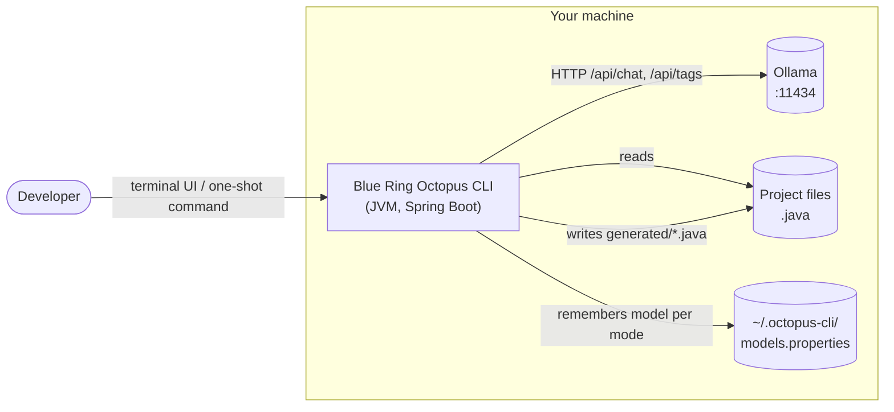
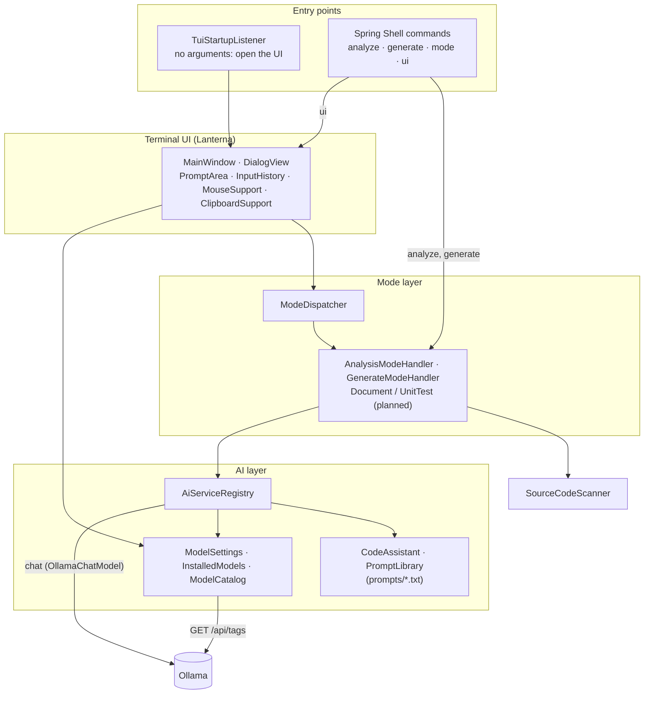
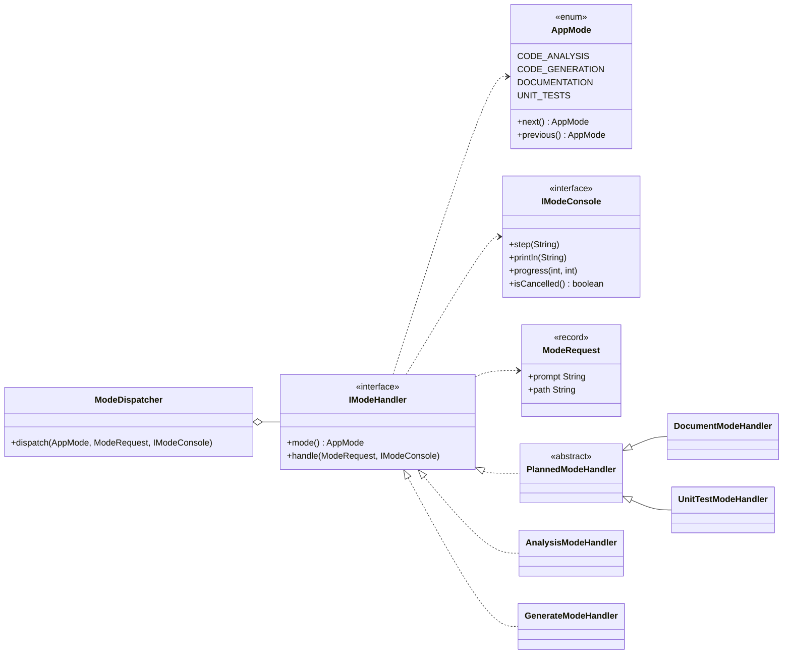
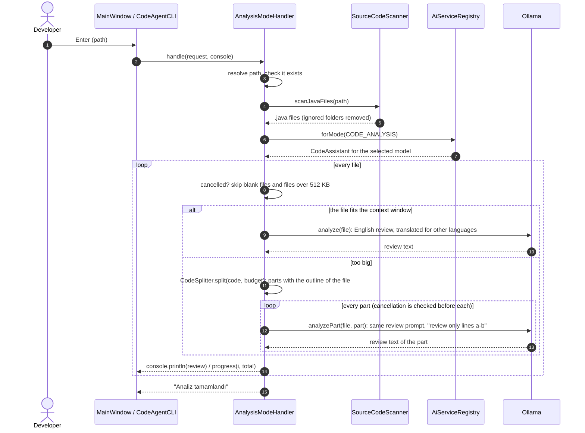
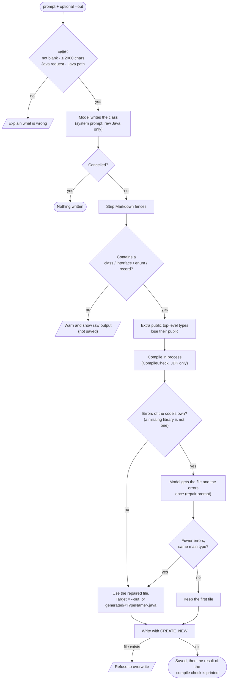

# Architecture

This document explains how Blue Ring Octopus CLI is put together: the layers, the main flows, where state is kept
and which design rules the code follows. All diagrams use [Mermaid](https://mermaid.js.org/), which GitHub renders
natively.

- [System context](#system-context)
- [Layers and components](#layers-and-components)
- [The mode layer](#the-mode-layer)
- [Flow: code analysis](#flow-code-analysis)
- [Flow: code generation](#flow-code-generation)
- [Data and persistence](#data-and-persistence)
- [Threading and cancellation](#threading-and-cancellation)
- [Design rules](#design-rules)
- [Extending the application](#extending-the-application)

## System context

The application is a single process. The only thing it talks to over the network is the Ollama HTTP API, which is
expected to run on the same machine (or on a host you configure).

Nothing is sent to a third-party service. If you point `LANGCHAIN4J_OLLAMA_CHAT_MODEL_BASE_URL` at a remote Ollama
instance, your code goes to that instance, so only do that with infrastructure you trust.

## Layers and components

The UI picks the handler for the current mode through `ModeDispatcher`; the one-shot commands call
`AnalysisModeHandler` and `GenerateModeHandler` directly. Both paths end up in the same handler code.

| Package | Responsibility |
|---|---|
| `cli` | Spring Shell commands for one-shot use (`analyze`, `generate`). |
| `command` | Spring Shell `mode` selector. |
| `config` | Spring wiring: executor, startup runner, shell prompt, `AppInfo` (version shown in the banner). |
| `context` | `AppMode` (the four modes) and `AppContext` (the current mode). |
| `i18n` | `Language` (the six interface languages) and `Messages` (every text shown to the user, loaded from `i18n/messages_<code>.properties`). |
| `mode` | One handler per mode, the dispatcher, the `ModeRequest` value object and the `IModeConsole` abstraction. |
| `model` | Everything about *which* model is used: client registry, installed-model discovery, per-mode settings, suggestions. |
| `service` | `CodeAssistant` (what is asked of the model), `PromptLibrary` (the prompt files), `ReviewLocalizer`, `ContextBudget`, `CompileCheck` (compiles generated code in process), `CodeSplitter` (cuts a big file into parts) and `SourceCodeScanner`. See [PROMPTS.md](PROMPTS.md). |
| `tui` | The Lanterna user interface. |
| `util` | `PathUtils`: quote stripping and relative-path resolution. |

## The mode layer

Modes are the unit of behaviour. `AppMode` lists them; each one must have exactly one `IModeHandler`. `ModeDispatcher`
verifies that at start-up and fails fast if a mode has no handler or two handlers.

`IModeConsole` is the seam between behaviour and presentation. The terminal UI implements it with a cancellable
`Job` that updates the status line, progress bar and output panel; the one-shot commands use `IModeConsole.stdout()`.
Handlers therefore contain no UI code and behave identically in both front ends.

## Flow: code analysis

Guards: files over **512 KB** are skipped and reported; a file that is too big for the model's context window
(`octopus.model.num-ctx`) is reviewed in parts (below); blank files are ignored, a missing path is reported instead of
failing, and the loop checks for cancellation before every file and every part.

`CodeSplitter` cuts a big file by member (method, field, initializer, nested type). A small scanner that skips
comments, strings, characters and text blocks finds the braces, so it works on a file that does not compile. Every
part holds the outline of the whole file (imports, the head and closing brace of each type, the signature of each member
that is not in this part, with `| ...` for what was left out) and the members of the part in full. The outline is
dropped step by step (imports first, then the other signatures) when it would take more than half of the window. A member
that does not fit at all is cut into overlapping pieces of lines. Lines keep their numbers from the file. Without any
braces the whole text is treated as one such member.

## Flow: code generation

The language check is a deliberate heuristic: a request that names another language (and not Java) is rejected
*before* the model is called, so no time is spent on output the tool would not accept.

`CompileCheck` compiles the file with the JDK's own compiler (`javax.tools`), in memory and with an empty class path, so
the libraries of the application never leak into the check. Errors that only say that a library is missing (`package ...
does not exist` outside `java.*`, and the "cannot find symbol" errors for the names such an import brought in) are not
counted as problems of the code; the packages are reported as not checked. A repair costs one more model call and is
skipped when the file and its answer would not fit the context window. A runtime without a compiler (the Docker image
has a JRE) skips the check and says so.

## Data and persistence

**There is no database, and that is intentional.** The application has no multi-user state, no relations to
query and nothing that must survive a crash beyond one tiny preference. Adding a database server (or even an embedded
one) would add a dependency, a failure mode and a migration story without buying anything.

| What | Where | Format | Written when |
|---|---|---|---|
| Model chosen for each mode | `~/.octopus-cli/models.properties` | Java properties, keyed by `AppMode` name | A model is picked in the model panel |
| Interface language | `~/.octopus-cli/settings.properties` (`language=de`) | Java properties | A language is picked with Ctrl+G |
| Application log | `logs/octopus.log` (override with `LOGGING_FILE_NAME`) | Text | Always (console output is switched off so it does not corrupt the UI) |
| Generated code | `generated/<TypeName>.java` or the `--out` path | Java source | Only in code generation mode, never over an existing file |

Model lookup order for a mode: the saved choice, otherwise `AI_MODEL_NAME`, otherwise `qwen2.5-coder`.

If this ever changes (conversation history, analysis reports that should be searchable, team sharing), start with
an embedded store such as SQLite and an ADR describing why a file is no longer enough.

## Threading and cancellation

- The UI runs on Lanterna's GUI thread. Long work never runs there: each task is submitted to `aiTaskExecutor`, a
  virtual-thread-per-task executor.
- A running task is a `Job`. Cancelling sets a flag, interrupts the thread and makes the job ignore any further
  output, so the UI is free again immediately even if the model keeps computing.
- Handlers poll `console.isCancelled()` between files and before writing to disk, so a cancelled generation never
  leaves a half-written file.
- `InstalledModels.refresh()` (the `/api/tags` call) also runs on the executor; when it finishes it hands the result
  back to the UI thread to redraw the model panel. The spinner has its own daemon thread.

## Design rules

1. **Local-first.** No telemetry, no hosted service. Limits (512 KB per file, 2000-character prompts) exist to keep
   requests small and fast on a local model.
2. **Never destroy user data.** Files are created with `CREATE_NEW`; cancellation happens before writes.
3. **Handlers don't know about the UI.** They talk to `IModeConsole` only.
4. **Fail fast at start-up.** A mode without a handler is a programming error caught by `ModeDispatcher`.
5. **Small, testable units.** Pure helpers (`PathUtils`, `AppInfo.normalize`, `InputHistory`, `SourceCodeScanner`)
   are plain classes that are unit-tested without a Spring context.
6. **No hard-coded user-facing text.** Every message goes through `Messages`; `MessagesTest` keeps the six language
   files in step (same keys, placeholders and line breaks, and widths that fit the narrow panels).

## Extending the application

To add a new mode (for example the planned documentation writer):

1. Add a constant to `AppMode` and its `mode.<NAME>.name`, `.prompt` and `.path` texts to every language file.
2. Add a prompt (`<name>.system.txt` and `<name>.user.txt` under `src/main/resources/prompts/`) and a method on
   `CodeAssistant` that renders it. Read [PROMPTS.md](PROMPTS.md) first.
3. Implement `IModeHandler` (or replace the `PlannedModeHandler` subclass for that mode). Use `IModeConsole` for all
   output and honour `isCancelled()`.
4. Add unit tests; `ModeDispatcher` already guarantees the wiring is complete.

To support another model backend, create the chat model in `AiServiceRegistry.create(...)`; the rest of the code only
sees `CodeAssistant`.
