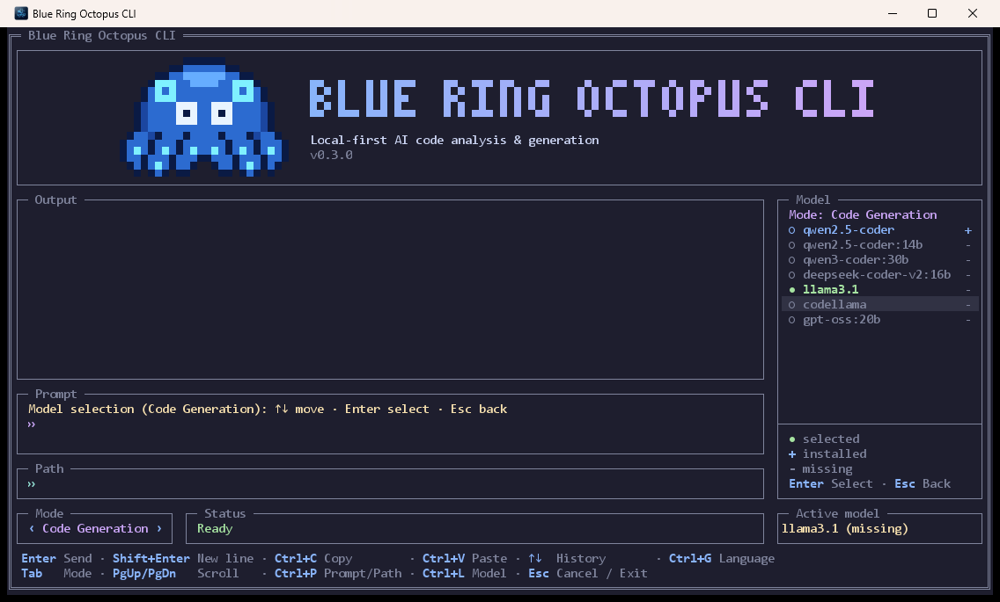

# Usage guide

Everything you can do with Blue Ring Octopus CLI, plus fixes for the problems people hit most often.
For installation, see the [README](../README.md#quick-start).

- [Before you start](#before-you-start)
- [The full-screen UI](#the-full-screen-ui)
- [Modes](#modes)
- [Choosing a model](#choosing-a-model)
- [One-shot commands](#one-shot-commands)
- [Configuration reference](#configuration-reference)
- [Troubleshooting](#troubleshooting)

## Before you start

1. Install and start [Ollama](https://ollama.com/download). Check that it answers:

   ```bash
   curl http://localhost:11434/api/tags
   ```

2. Pull at least one model. The default is `qwen2.5-coder`:

   ```bash
   ollama pull qwen2.5-coder
   ```

3. Run the application with **JDK 25**. `java -version` should report 25.

## The full-screen UI

Start the application without arguments:

```bash
java --enable-native-access=ALL-UNNAMED -jar blue-ring-octopus-cli.jar
```

```
┌ Blue Ring Octopus CLI ───────────────────────────────────────────────────────┐
│ ┌ banner ──────────────────────────────────────────────────────────────────┐ │
│ └──────────────────────────────────────────────────────────────────────────┘ │
│ ┌ Output ─────────────────────────────────────────────┐ ┌ Model ──────────┐ │
│ │ requests and answers of the session                 │ │ model for the   │ │
│ └─────────────────────────────────────────────────────┘ │ current mode    │ │
│ ┌ Prompt ─────────────────────────────────────────────┐ │ ● selected      │ │
│ │ hint + multi-line input                             │ │ + installed     │ │
│ └─────────────────────────────────────────────────────┘ │ - not installed │ │
│ ┌ Path ───────────────────────────────────────────────┐ └─────────────────┘ │
│ └─────────────────────────────────────────────────────┘                     │
│ ┌ Mode ┐ ┌ Status / progress ───────────────────────────┐ ┌ Active model ──┐ │
│ key hints                                                                    │
└──────────────────────────────────────────────────────────────────────────────┘
```

The **Output** box is the conversation: every request appears under a "You" heading with the mode and model, and
the answer under "Octopus". It starts empty. The history of the session stays in memory (up to 5000 lines) and is gone
when you quit. Every new message scrolls the view to the bottom; scroll up to read earlier ones. You can select text
in it with the mouse and copy it (see Mouse below). The **Prompt** box below it is where you type; the line above the
input tells what the current mode expects.

On Windows the UI opens in its own window (the title is *Blue Ring Octopus CLI*); closing it with the **X** button
asks for confirmation. On Linux and macOS it draws inside the current terminal, so use a terminal with true-colour
and UTF-8 support.

### Keyboard shortcuts

| Key | Action |
|---|---|
| <kbd>Enter</kbd> | Run the current mode |
| <kbd>Shift</kbd>+<kbd>Enter</kbd>, <kbd>Alt</kbd>+<kbd>Enter</kbd> or a trailing `\` | Insert a new line in the prompt |
| <kbd>Tab</kbd> / <kbd>Shift</kbd>+<kbd>Tab</kbd> | Next / previous mode |
| <kbd>↑</kbd> / <kbd>↓</kbd> | Move between lines of a multi-line prompt, then step through input history |
| <kbd>Ctrl</kbd>+<kbd>P</kbd> | Switch focus between the Prompt field and the Path field |
| <kbd>Ctrl</kbd>+<kbd>L</kbd> | Open (or close) the model panel for the current mode |
| <kbd>Ctrl</kbd>+<kbd>G</kbd> | Choose the interface language, see [Language](#language) |
| <kbd>Ctrl</kbd>+<kbd>V</kbd>, <kbd>Shift</kbd>+<kbd>Insert</kbd> | Paste. In the Path field, surrounding quotes from Windows "Copy as path" are removed |
| <kbd>Ctrl</kbd>+<kbd>C</kbd> | Copy the selected text, or the output of the last run when nothing is selected |
| <kbd>PgUp</kbd> / <kbd>PgDn</kbd> | Scroll the conversation while typing |
| Mouse wheel | Over the conversation: scroll it. Over the prompt: scroll a long prompt without moving the caret |
| Left click | On the Prompt or Path box: focus it (clicking inside the text also places the caret) |
| Left click | On an arrow (<kbd>‹</kbd> <kbd>›</kbd>) of the Mode box: previous / next mode |
| Left click | On the Model panel: focus it, and on a model move the cursor there. Double click on a model: choose it |
| Drag, double click, triple click | In the Output box: select text, a word, a line. <kbd>Ctrl</kbd>+<kbd>C</kbd> copies it |
| <kbd>Esc</kbd> | While a task runs: ask to cancel it. Otherwise: ask to exit |

Typing `exit` (or `cikis`) in the prompt and pressing <kbd>Enter</kbd> also quits.

**Mouse.** The mouse does a few things, on purpose: the wheel scrolls the Output box and a long prompt; a left click focuses the Prompt or Path box, switches the mode on the arrows of the Mode box and focuses the Model panel (a double click on a model chooses it); and dragging in the Output box selects text, a double click selects a word and a triple click a line. Touchpads (smooth, fractional scrolling) work too. The buttons of the exit and cancel dialogs and the rows of the language picker can be clicked too. Everything else (the keys of the model panel) stays on the keyboard. Mouse support currently exists in the Windows window only; in a Linux/macOS terminal the mouse keeps its normal behaviour, so you can still select and copy text with it.

## Modes

Switch modes with <kbd>Tab</kbd>. The hint line above the input shows what the current mode expects.

| Mode | Prompt | Path | What it does |
|---|---|---|---|
| **Code Analysis** | not used | file or folder; empty means the working directory | Reviews every `.java` file found: bugs and security, performance, Clean Code. The report is written in Turkish. |
| **Code Generation** | what to write, up to 2000 characters | optional target `.java` file | Writes one Java type. Empty path means `generated/<TypeName>.java`. Existing files are never overwritten. |
| **Documentation** | – | – | Planned. Selecting it prints a "not ready yet" message. |
| **Unit Tests** | – | – | Planned. Selecting it prints a "not ready yet" message. |

Limits and behaviour worth knowing:

- Files larger than **64 KB**, or too big for the model's context window (see [Configuration reference](#configuration-reference)),
  are skipped and listed with a message; the model would otherwise see only a fragment of them.
- A review is written in English first and translated for the other languages, see [PROMPTS.md](PROMPTS.md).
- These folders are never scanned: `.git`, `.idea`, `.mvn`, `.vscode`, `.gradle`, `target`, `build`, `node_modules`, `logs`.
- Code generation is **Java only**. A request that names another language (Python, C#, ...) without mentioning Java is
  rejected before the model is called.
- The generated file is compiled before it is saved. If it has errors, the model fixes them once; the fixed version is
  used only if it has fewer errors. The file is saved either way, and the line under it says whether it compiles. A
  library the request names (Spring, Jakarta, ...) is not available to this check: code that uses one is checked for
  everything else, and the libraries are listed as not checked. The check needs a JDK; the Docker image has only a JRE,
  where it is skipped with a note. Extra `public` types next to the main one lose their `public`, because a file can
  hold only one.
- Relative paths are resolved against the directory the application was started in.

## Choosing a model

Each mode remembers its own model, so you can use a small fast model for reviews and a larger one for generation.

1. Press <kbd>Ctrl</kbd>+<kbd>L</kbd>.
2. Move with <kbd>↑</kbd> <kbd>↓</kbd>, choose with <kbd>Enter</kbd>, leave with <kbd>Esc</kbd>.
3. The colours tell the state at a glance: **green** is the model selected for this mode, **blue** (`+`) is installed in
   Ollama and can be chosen, **grey** (`-`) is not installed. The highlighted row is the cursor. Choosing a missing model
   prints the exact `ollama pull <name>` command to run.

<p align="center">
  
  <br><sub>Code Generation mode: the selected model (green) is not installed, the installed one (blue) can be chosen, the rest are grey.</sub>
</p>

The list has suggestions for the mode, best first (for example `qwen3-coder:30b` and `qwen2.5-coder:14b` for code
generation, `gpt-oss:20b` for reviews and documentation), plus anything else you have installed. The order is a
recommendation, not a measurement: the prompts were tuned with `qwen2.5-coder` (7B), which fits a graphics card with
8 GB. Bigger models need more memory and are slower; try one before you rely on it. Your choice is stored in
`~/.octopus-cli/models.properties`.

## One-shot commands

When you pass arguments the UI is skipped: the command runs, prints to standard output and exits. This is what you want
in scripts, CI jobs and containers.

```bash
# analyze: review a file or a folder (default: current directory)
java --enable-native-access=ALL-UNNAMED -jar blue-ring-octopus-cli.jar analyze --pathInput ./src

# generate: write a class, optionally to a chosen file
java --enable-native-access=ALL-UNNAMED -jar blue-ring-octopus-cli.jar generate \
  --prompt "A Spring REST controller for products" --out src/main/java/demo/ProductController.java

# discover everything else
java --enable-native-access=ALL-UNNAMED -jar blue-ring-octopus-cli.jar help
java --enable-native-access=ALL-UNNAMED -jar blue-ring-octopus-cli.jar help generate
```

| Command | Options | Description |
|---|---|---|
| `analyze` | `--pathInput <file or folder>` (default `.`) | Review Java files. |
| `generate` | `--prompt <text>` (required), `--out <file.java>` (optional) | Generate and save a Java class. |
| `ui`, `dashboard` | – | Open the full-screen UI. |
| `mode`, `mod` | – | Interactive mode selector. |
| `help`, `history`, `version`, `script` | – | Built-in Spring Shell commands. |

The one-shot `analyze` and `generate` commands always use the default model (`AI_MODEL_NAME`, or `qwen2.5-coder`)
unless you have saved a different model for that mode in the UI.

## Language

The interface speaks **English** (the default), **Türkçe**, **Deutsch**, **Français**, **Italiano** and **Español**.
The model is asked to answer in the same language, and so are the mode names, hints, messages and dialogs.

- Press <kbd>Ctrl</kbd>+<kbd>G</kbd>, pick a language with <kbd>↑</kbd> / <kbd>↓</kbd> and press <kbd>Enter</kbd>
  (<kbd>Esc</kbd> cancels). It applies at once; text that is already in the conversation keeps its language. The
  choice is saved to `~/.octopus-cli/settings.properties`.
- Set the `OCTOPUS_LANG` environment variable (`en`, `tr`, `de`, `fr`, `it` or `es`) to choose the language for one
  run, in Docker or for the one-shot commands. It takes priority over the saved choice.
- The help texts of the one-shot commands (`help`, `help generate`) are always English.

## Configuration reference

| Setting | Where | Default |
|---|---|---|
| `AI_MODEL_NAME` | environment variable | `qwen2.5-coder` |
| `LANGCHAIN4J_OLLAMA_CHAT_MODEL_BASE_URL` | environment variable | `http://localhost:11434` |
| `langchain4j.ollama.chat-model.temperature` | `application.yaml` or `LANGCHAIN4J_OLLAMA_CHAT_MODEL_TEMPERATURE` | `0.2` |
| `langchain4j.ollama.chat-model.timeout` | `application.yaml` or `LANGCHAIN4J_OLLAMA_CHAT_MODEL_TIMEOUT` | `5m` |
| `logging.file.name` | `LOGGING_FILE_NAME` | `logs/octopus.log` |
| Per-mode model | UI model panel | stored in `~/.octopus-cli/models.properties` |
| `OCTOPUS_LANG` | environment variable, or <kbd>Ctrl</kbd>+<kbd>G</kbd> in the UI | `en`; the UI choice is stored in `~/.octopus-cli/settings.properties` |
| `octopus.model.num-ctx` | `OCTOPUS_MODEL_NUM_CTX` | `8192` (tokens; the context window asked from Ollama, whose own default cuts long prompts silently) |
| `octopus.model.max-tokens` | `OCTOPUS_MODEL_MAX_TOKENS` | `4096` (upper limit for one answer) |

Any Spring Boot property can be overridden with an environment variable (dots and dashes become underscores, upper
case) or with `--property=value` on the command line.

## Troubleshooting

**The model panel says "Ollama'ya ulaşılamadı" (Ollama is unreachable).**
Start Ollama (`ollama serve`) and check `curl http://localhost:11434/api/tags`. If Ollama runs elsewhere (another
machine, or the Docker host), set `LANGCHAIN4J_OLLAMA_CHAT_MODEL_BASE_URL`.

**"Model kurulu değil" (model not installed).**
Run the `ollama pull <name>` command that the application prints.

**The analysis stops with a timeout.**
Large models on CPU can take minutes per file. Raise `langchain4j.ollama.chat-model.timeout` (default `5m`) or pick a
smaller model.

**`UnsupportedClassVersionError` or "class file version 69.0".**
The JAR needs Java 25. Run `java -version` and install a JDK 25 build.

**A `WARNING: A restricted method ... has been called` message appears.**
Add `--enable-native-access=ALL-UNNAMED` to the `java` command, as in every example here.

**Docker: the container cannot reach Ollama.**
On Linux add `--add-host=host.docker.internal:host-gateway` to `docker run`. If Ollama only listens on
`127.0.0.1`, start it with `OLLAMA_HOST=0.0.0.0` so the container can connect.

**Docker: generated files cannot be written.**
The image runs as an unprivileged user. Run it as yourself: `docker run --user "$(id -u):$(id -g)" ...`.

**A `blue-ring-octopus-cli.log` file appears in my project folder.**
It is the Spring Shell command history that one-shot commands write to the working directory. It is safe to delete and
is covered by `*.log` in this repository's `.gitignore`. The Docker image disables it.

Still stuck? [Open an issue](https://github.com/burak-can-onarim/blue-ring-octopus-cli/issues/new/choose) with your
OS, `java -version`, the model you used and the relevant lines of `logs/octopus.log`.
